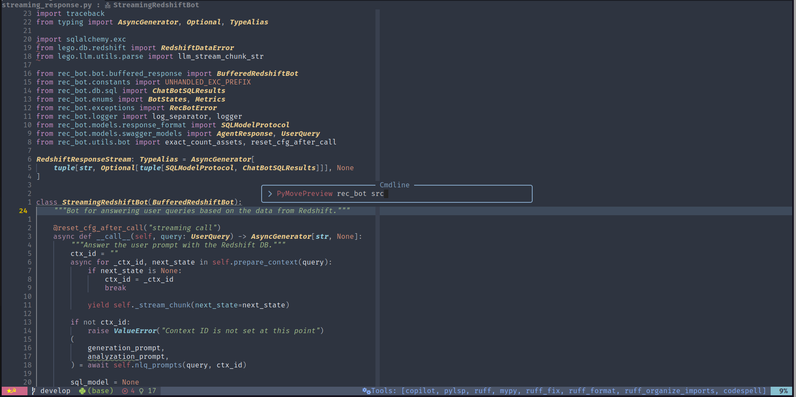
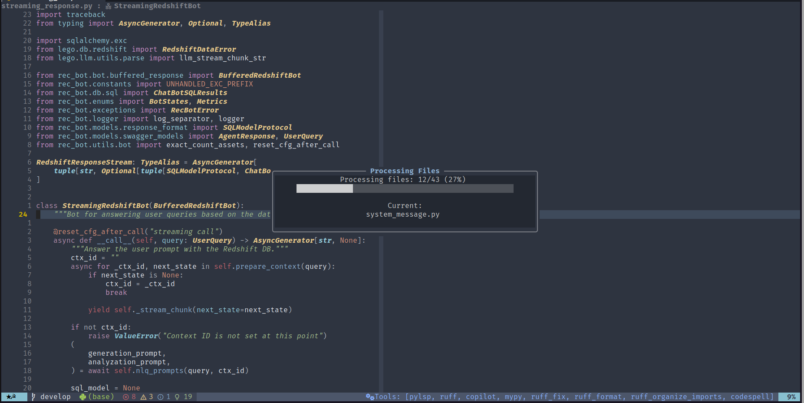
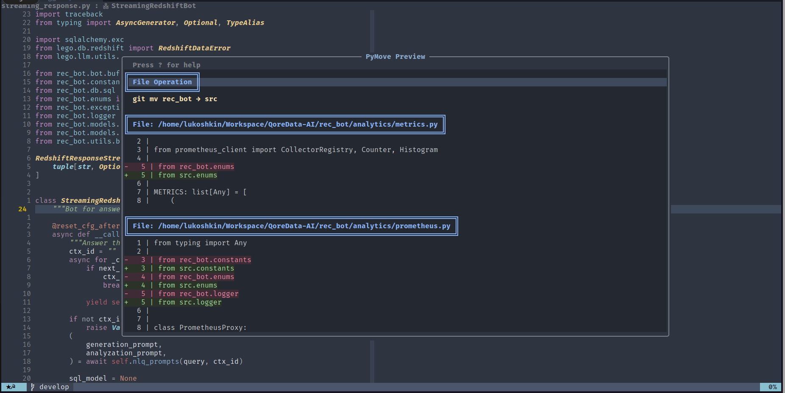
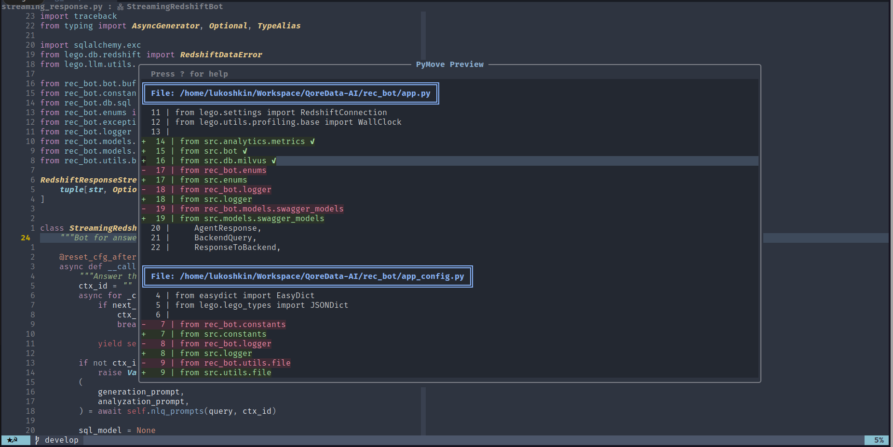

# pymove.nvim

A comprehensive Neovim plugin for Python development that provides intelligent code organization and refactoring capabilities.

## Overview

**pymove.nvim** combines two powerful features for Python development:

1. **Move** - Refactor module/package locations with automatic import updates
1. **Sort** (beta) - Intelligently organize functions and class methods

## Demo






## Features

### Move/Rename

- Move or rename Python modules and packages
- Automatic import updates across entire project
- Interactive preview with per-file change approval
- Git integration with `git mv` support
- Safe validation before execution

[**→ Detailed Move Documentation**](lua/move/README.md)

### Sorting

- Smart method categorization (dunder → public → private)
- Preserve special methods like `__init__` at the top
- Dependency-aware topological sorting for module functions
- Multiple sorting scopes (visual selection, class, file)
- Treesitter-powered for fast and accurate parsing

[**→ Detailed Sort Documentation**](lua/sort/README.md)

## Requirements

- Neovim 0.11+
- Python treesitter parser: `:TSInstall python`
- ripgrep (`rg`) for move functionality
- plenary.nvim

## Installation

### lazy.nvim

```lua
{
  dir = "~/.config/evangelist/pymove",
  name = "pymove.nvim",
  ft = "python",
  dependencies = { "nvim-lua/plenary.nvim" },
  opts = {
    -- Sorting configuration
    sorting = {
      preserve_methods = { "__init__", "__new__", "__str__", "__repr__" },
      categories = { "dunder", "public", "private" },
      sort_within_categories = false,
      enable_dependency_sort = true,
      module_categories = { "constants", "public", "utility" },
      keymaps = {
        sort_class = "<Space>mc",
        sort_file = "<Space>mm",
        sort_visual = "<Space>m",
      },
    },

    -- Move/rename configuration
    move = {
      use_git = nil,  -- Auto-detect
      keymaps = {
        move_ui = "<Space>mr",
      },
    },
  },
}
```

## Quick Start

### Moving/Renaming

```vim
" Interactive move with preview
:PyMoveUI

" Preview move operation
:PyMovePreview src/old.py src/new/location.py

" Direct move (no preview)
:PyMove src/old.py src/new/location.py --git
```

**Default keymap:**

- `<Space>mr` - Interactive move/rename with UI

### Sorting

```vim
" Sort methods in current class
:PySortClass

" Sort entire file
:PySortFile

" Sort visual selection (in visual mode)
:PySortMethods visual
```

**Default keymaps:**

- `<Space>mc` - Sort methods in current class
- `<Space>mm` - Sort all functions/methods in file
- `<Space>m` - Sort functions/methods in visual selection (visual mode)

## Examples

### Sorting a Class

**Before:**

```python
class MyClass:
    def _private_helper(self):
        pass

    def __str__(self):
        return "MyClass"

    def public_method(self):
        pass

    def __init__(self):
        pass
```

**After** (`:PySortClass`):

```python
class MyClass:
    def __init__(self):
        pass

    def __str__(self):
        return "MyClass"

    def public_method(self):
        pass

    def _private_helper(self):
        pass
```

### Moving a Module

**Command:**

```vim
:PyMovePreview src/utils.py src/helpers/utils.py
```

**Automatic import updates:**

```python
# Before
from src.utils import helper_function

# After
from src.helpers.utils import helper_function
```

## Configuration

### Minimal Configuration

```lua
{
  dir = "~/.config/evangelist/pymove",
  name = "pymove.nvim",
  ft = "python",
  dependencies = { "nvim-lua/plenary.nvim" },
  opts = {},  -- Use all defaults
}
```

### Disable Default Keymaps

```lua
opts = {
  sorting = {
    keymaps = false,  -- Disable all sorting keymaps
  },
  move = {
    keymaps = false,  -- Disable all move keymaps
  },
},
keys = {
  -- Define your own keymaps
  { "<leader>ps", function() require("pymove").sort_class() end,
    desc = "Sort Python class" },
  { "<leader>pm", function() require("move").move_with_ui() end,
    desc = "Move Python module" },
}
```

### Customize Sorting Behavior

```lua
opts = {
  sorting = {
    -- Keep more special methods at top
    preserve_methods = {
      "__init__",
      "__new__",
      "__str__",
      "__repr__",
      "__eq__",
      "__hash__",
    },

    -- Sort alphabetically within categories
    sort_within_categories = true,

    -- Disable module-level sorting
    module_categories = {},

    -- Put functions before classes at module level
    put_functions_before_classes = true,
  },
}
```

## Commands Reference

### Sorting Commands

| Command                  | Description                                   |
| ------------------------ | --------------------------------------------- |
| `:PySortClass`           | Sort methods in the class at cursor           |
| `:PySortFile`            | Sort all functions and methods in file        |
| `:PySortMethods <scope>` | Sort with scope: `visual`, `class`, or `file` |

### Move/Rename Commands

| Command                      | Description                               |
| ---------------------------- | ----------------------------------------- |
| `:PyMoveUI`                  | Interactive move with prompts and preview |
| `:PyMovePreview <old> <new>` | Preview changes before applying           |
| `:PyMove <old> <new>`        | Move directly without preview             |

## Lua API

### Sorting API

```lua
local pymove = require("pymove")

-- Sort current class
pymove.sort_class()

-- Sort entire file
pymove.sort_file()

-- Sort visual selection
pymove.sort_visual()

-- Generic function with scope
pymove.sort_python("class")  -- "visual" | "class" | "file"
```

### Move/Rename API

```lua
local move = require("move")

-- Move with automatic import updates
move.move_module_or_package(
  "old/module.py",
  "new/location/module.py",
  nil,  -- project_root (nil = auto-detect)
  { use_git = true, dry_run = false }
)

-- Preview changes interactively
move.preview_move("old/module.py", "new/location/module.py")

-- Interactive move with UI
move.move_with_ui()
```

## Advanced Features

### Dependency-Aware Sorting

The plugin analyzes function calls and uses topological sorting to ensure dependencies are defined before use:

```python
# Before
def caller():
    helper()

def helper():
    pass

# After (dependency-aware)
def helper():
    pass

def caller():
    helper()
```

### Interactive Move Preview

The move preview window provides:

- Visual diff of all changes
- Per-file change approval/rejection
- Navigation between changes
- Context lines for clarity
- Accept/decline individual or all changes

See [Move Documentation](lua/move/README.md) for preview keymaps and details.

## Documentation

- [**Sort Documentation**](lua/sort/README.md) - Detailed sorting features and configuration
- [**Move Documentation**](lua/move/README.md) - Detailed refactoring features and preview UI

## Troubleshooting

### Sorting not working

- Ensure Python treesitter parser is installed: `:TSInstall python`
- Check if file is recognized as Python: `:set filetype?`

### Move not finding files

- Ensure ripgrep (`rg`) is installed: `rg --version`
- Check if you're in the correct project root

### Preview window issues

- Update plenary.nvim to latest version
- Check for conflicting highlight groups

## License

MIT

## Contributing

Contributions are welcome! This plugin is designed to make Python development in Neovim more productive through intelligent code organization and refactoring.
